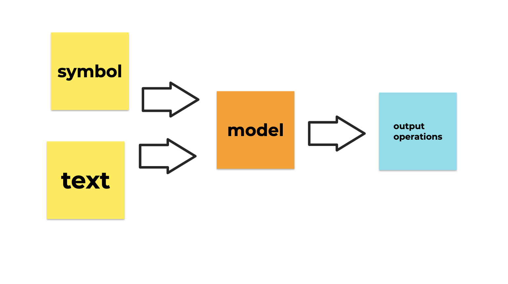
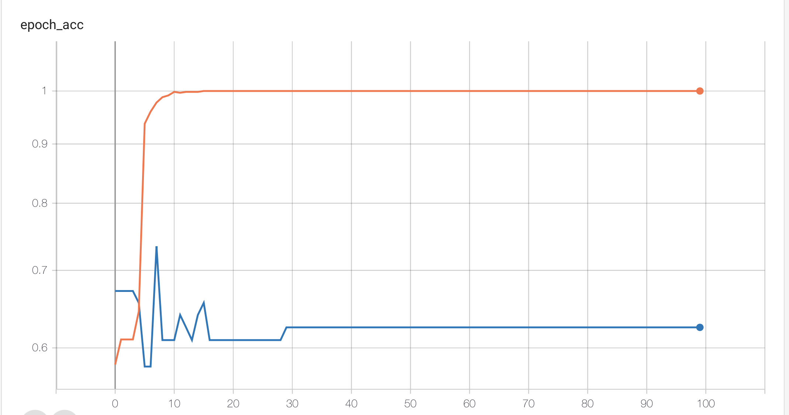
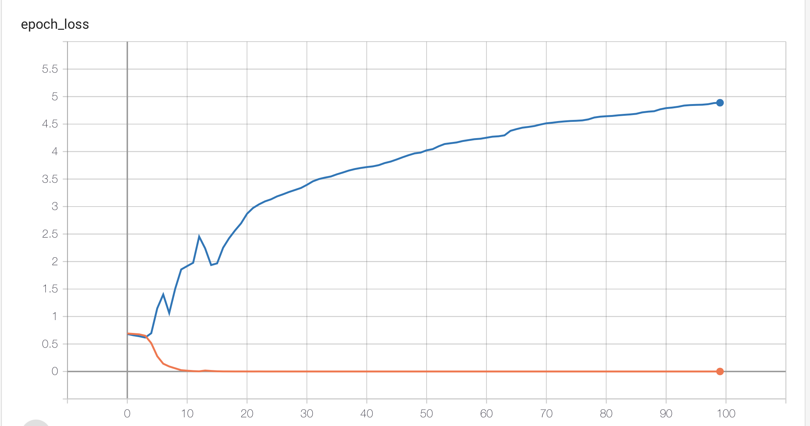
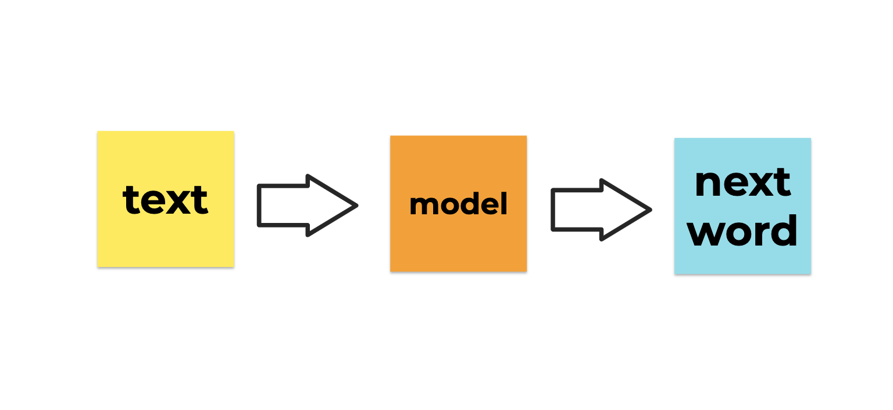
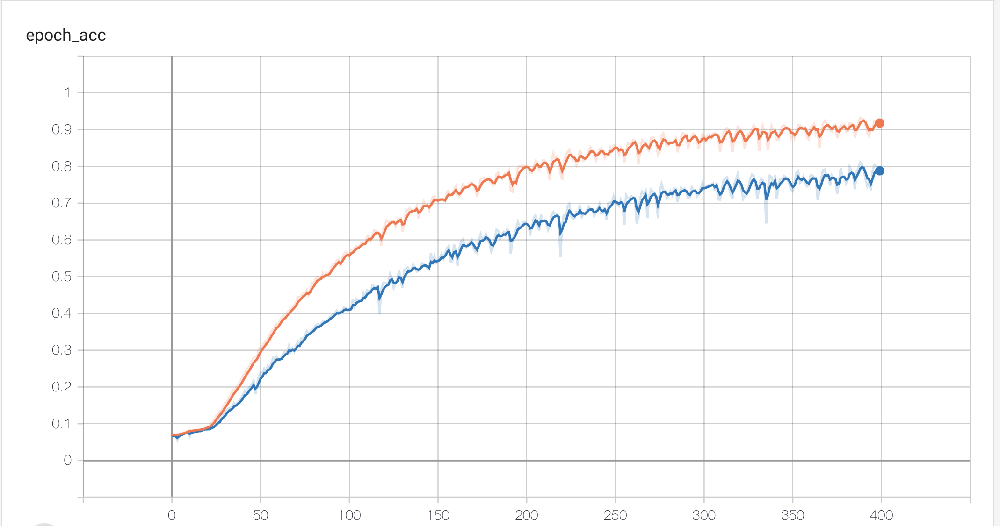
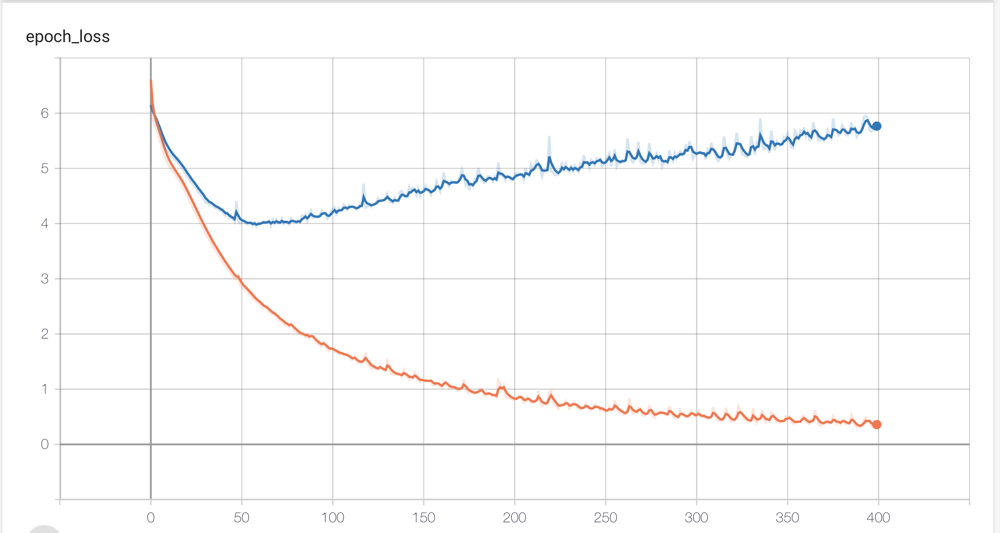

<h1>S.A.M.U.E.L.</h1>

<h3>Semantic</h3>
<h3>Analysis</h3>
<h3>Machine that</h3>
<h3>Understands</h3>
<h3>English</h3>
<h3>Literature</h3>

<strong>Abstract: </strong>
Uses Tensorflow and Keras to train text classification and text generation on poetry. Dataset is by English poet <a href="https://en.wikipedia.org/wiki/Samuel_Taylor_Coleridge">Samuel Taylor Coleridge</a>. Text classifier identifies ket poetic symbolism used in the text. Text generator tries to emulate the writing style.

<h3>Symbol Classifier</h3>

<h3>Text Generator</h3>

